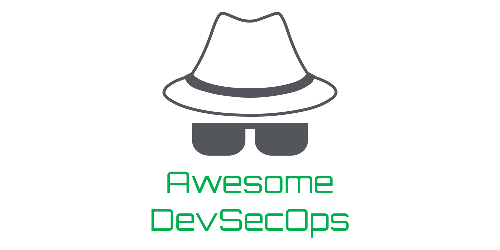

  

> Curating the best DevSecOps resources and tooling.

[DevSecOps](https://www.rapid7.com/fundamentals/devsecops/) is an extension of the [DevOps](https://www.atlassian.com/devops) movement that aims to bring security practices into the development lifecycle through developer-centric security tooling and processes.

Contributions welcome. Add links through pull requests or create an issue to start a discussion.

<!-- omit in toc -->
## Contents
- [Resources](#resources)
  - [Articles](#articles)
  - [Communities](#communities)
  - [Conferences](#conferences)
  - [Podcasts](#podcasts)
  - [Secure Development Guidelines](#secure-development-guidelines)
  - [Secure Development Lifecycle Framework](#secure-development-lifecycle-framework)
  - [Toolchains](#toolchains)
  - [Training](#training)
- [Tools](#tools)
  - [Dependency Management](#dependency-management)
  - [Dynamic Analysis](#dynamic-analysis)
  - [Infrastructure as Code Analysis](#infrastructure-as-code-analysis)
  - [Intentionally Vulnerable Applications](#intentionally-vulnerable-applications)
  - [Monitoring](#monitoring)
  - [Secrets Management](#secrets-management)
  - [Static Analysis](#static-analysis)
  - [Threat Modelling](#threat-modelling)
- [Related Lists](#related-lists)

## Resources

### Articles

- [Our Approach to Employee Security Training](https://www.pagerduty.com/blog/security-training-at-pagerduty/) - _Pager Duty_ - Guidelines to running security training within an organisation.

### Communities

- [MyDevSecOps](https://www.mydevsecops.io/) - _Snyk_ - A community that runs conferences, a blog, a podcast and a Slack workspace dedicated to DevSecOps.

### Conferences

- [AppSec Day](https://appsecday.io/) - _OWASP_ - An Australian application security conference run by OWASP.
- [DevSecCon](https://www.devseccon.com/) - _Snyk_ - A network of DevSecOps conferences run by Snyk.

### Podcasts

- [Absolute AppSec](https://absoluteappsec.com/) - _Seth Law & Ken Johnson_ - Discussions about current events and specific topics related to application security.
- [Application Security Podcast](https://podcast.securityjourney.com/) - _Security Journey_ - Interviews with industry experts about specific application security concepts.
- [BeerSecOps](https://blog.aquasec.com/devsecops-podcasts) - _Aqua Security_ - Breaking down the silos of Dev, Sec and Ops, discussing topics that span these subject areas.
- [DevSecOps Podcast Series](https://soundcloud.com/owasp-podcast) - _OWASP_ - Discussions with thought leaders and practitioners to integrate security into the development lifecycle.
- [The Secure Developer](https://www.mydevsecops.io/the-secure-developer-podcast) - _Snyk_ - Discussion about security tools and best practices for software developers.

### Secure Development Guidelines

- [Application Security Verification Standard](https://owasp.org/www-project-application-security-verification-standard/) - _OWASP_ - A framework of security requirements and controls to help developers design and develop secure web applications.
- [Coding Standards](https://wiki.sei.cmu.edu/confluence/display/seccode/SEI+CERT+Coding+Standards) - _CERT_ - A collection of secure development standards for C, C++, Java and Android development.
- [Proactive Controls](https://owasp.org/www-project-proactive-controls/) - _OWASP_ - OWASP's list of top ten controls that should be implemented in every software development project.
- [Secure Coding Guidelines](https://wiki.mozilla.org/WebAppSec/Secure_Coding_Guidelines) - _Mozilla_ - A guideline containing specific secure development standards for secure web application development.
- [Secure Coding Practices Quick Reference Guide](https://owasp.org/www-pdf-archive/OWASP_SCP_Quick_Reference_Guide_v2.pdf) - _OWASP_ - A checklist to verify that secure development standards have been followed.

### Secure Development Lifecycle Framework

- [Secure Development Lifecycle](https://www.microsoft.com/en-us/securityengineering/sdl/practices) - _Microsoft_ - A collection of tools and practices that serve as a framework for the secure development lifecycle.
- [Secure Software Development Framework](https://csrc.nist.gov/CSRC/media/Publications/white-paper/2019/06/07/mitigating-risk-of-software-vulnerabilities-with-ssdf/draft/documents/ssdf-for-mitigating-risk-of-software-vulns-draft.pdf) - _NIST_ - A framework consisting of practices, tasks and implementation examples for a secure development lifecycle.
- [Software Assurance Maturity Model](https://github.com/OWASP/samm) - _OWASP_ - A framework to measure and improve the maturity of the secure development lifecycle.

### Toolchains

- [Periodic Table of DevOps Tools](https://xebialabs.com/periodic-table-of-devops-tools/) - _XebiaLabs_ - A collection of DevSDevOps and security ecOps tooling categorised by tool functionality.
- [Secure DevOps Toolchain](https://www.sans.org/security-resources/posters/secure-devops-toolchain-swat-checklist/60/download) - _SANS_ - A list of security specific practices and tooling categorised into pipeline phases and tool functionality.

### Training

- [Cybrary](https://www.cybrary.it/) - _Cybrary_ - Subscription based online courses with dedicated categories for cybersecurity and DevSecOps.
- [PentesterLab](https://pentesterlab.com/) - _PentesterLab_ - Hands on labs to understand and exploit simple and advanced web vulnerabilities.
- [Security Training for Engineers](https://sudo.pagerduty.com/for_engineers/) - _Pager Duty_ - A presentation created and open-sourced by PagerDuty to provide security training to software engineers.
- [Security Training for Everyone](https://sudo.pagerduty.com/for_everyone/) - _Pager Duty_ - A presentation created and open-sourced by PagerDuty to provide security training employees.
- [Web Security Academy](https://portswigger.net/web-security) - _PortSwigger_ - A set of materials and labs to learn and exploit common web vulnerabilities.

## Tools

### Dependency Management

Open source software packages can speed up the development process by allowing developers to implement functionality without having to write all of the code. However, with the open source code comes open source vulnerabilities. Dependency management tools help manage vulnerabilities in open source packages by identifying and updating packages with known vulnerabilities.

- [Dependabot](https://dependabot.com/) - _GitHub_ - Automatically scan GitHub repositories for vulnerabilities and create pull requests to merge in patched dependencies.
- [Dependency-Check](https://owasp.org/www-project-dependency-check/) - _OWASP_ - Scans dependencies for publicly disclosed vulnerabilities using CLI or build server plugins.
- [Dependency-Track](https://dependencytrack.org/) - _OWASP_ - Monitor the volume and severity of vulnerable dependencies across multiple projects over time.
- [JFrog XRay](https://jfrog.com/xray/) - _JFrog_ - Security and compliance analysis for artifacts stored in JFrog Artifactory.
- [NPM Audit](https://docs.npmjs.com/cli/audit) - _NPM_ - Vulnerable package auditing for node packages built into the npm CLI.
- [Renovate](https://renovate.whitesourcesoftware.com/) - _WhiteSource_ - Automatically monitor and update software dependencies for multiple frameworks and languages using a CLI or git repository apps.
- [Requires.io](https://requires.io/) - _Olivier Mansion & Alexis Tabary_ - Automated vulnerable dependency monitoring and upgrades for Python projects.
- [Snyk Open Source](https://snyk.io/) - _Snyk_ - Automated vulnerable dependency monitoring and upgrades using Snyk's dedicated vulnerability database.

### Dynamic Analysis

Dynamic Analysis Security Testing (DAST) is a form of black-box security testing where a security scanner interacts with a running instance of an application, emulating malicious activity to find common vulnerabilities. DAST tools are commonly used in the initial phases of a penetration test, and can find vulnerabilities such as cross-site scripting, SQL injection, cross-site request forgery and information disclosure.

- [Automatic API Attack Tool](https://github.com/imperva/automatic-api-attack-tool) - _Imperva_ - Perform automated security scanning against an API based on an API specification.
- [BurpSuite Enterprise Edition](https://portswigger.net/burp/enterprise) - _PortSwigger_ - BurpSuite's web application vulnerability scanner used widely by penetration testers, modified with CI/CD integration and continuous monitoring over multiple web applications.
- [Gauntlt](https://github.com/gauntlt/gauntlt) - _Gauntlt_ - A Behaviour Driven Development framework to run security scans using common security tools and test output, defined using Gherkin syntax.
- [SSL Labs Scan](https://github.com/ssllabs/ssllabs-scan) - _SSL Labs_ - Automated scanning for SSL / TLS configuration issues.
- [Zed Attack Proxy (ZAP)](https://github.com/zaproxy/zaproxy) - _OWASP_ - An open-source web application vulnerability scanner, including an API for CI/CD integration.

### Infrastructure as Code Analysis

Infrastructure as Code allows applications to be deployed reliably to a consistent environment. This not only ensures that infrastructure is consistently hardened, but also provides an opportunity to statically and dynamically analyse infrastructure definitions for vulnerable dependencies, hard-coded secrets, insecure configuration and unintentional changes in security configuration. The following tools facilitate this analysis.

<!-- omit in toc -->
#### Cloud Formation
- [Cfn Nag](https://github.com/stelligent/cfn_nag) - _Stelligent_ - Scan AWS CloudFormation templates for insecure configuration.
- [Checkov](https://github.com/bridgecrewio/checkov) - _Bridgecrew_ - Scan Terraform, AWS CloudFormation and Kubernetes templates for insecure configuration.

<!-- omit in toc -->
#### Containers
- [Clair](https://github.com/quay/clair) - _Quay_ - Scan App Container and Docker containers for publicly disclosed vulnerabilities.
- [Dagda](https://github.com/eliasgranderubio/dagda/) - _Elías Grande_ - Compares OS and software dependency versions installed in Docker containers with public vulnerability databases, and also performs virus scanning.
- [Snyk Container](https://snyk.io/product/container-vulnerability-management/) - _Snyk_ - Scan Docker and Kubernetes applications for security vulnerabilities during CI/CD or via continuous monitoring.

<!-- omit in toc -->
#### Terraform
- [Checkov](https://github.com/bridgecrewio/checkov) - _Bridgecrew_ - Scan Terraform, AWS CloudFormation and Kubernetes templates for insecure configuration.
- [Terrascan](https://github.com/cesar-rodriguez/terrascan) - _Cesar Rodriguez_ - Scan Terraform templates for best practice security configuration.
- [Tfsec](https://github.com/liamg/tfsec) - _Liam Galvin_ - Scan Terraform templates for security misconfiguration and noncompliance with AWS, Azure and GCP security best practice.

<!-- omit in toc -->
#### Kubernetes
- [Checkov](https://github.com/bridgecrewio/checkov) - _Bridgecrew_ - Scan Terraform, AWS CloudFormation and Kubernetes templates for insecure configuration.
- [Kube-Score](https://github.com/zegl/kube-score) - _Gustav Westling_ - Scan Kubernetes object definitions for security and performance misconfiguration.
- [Kubectrl Kubesec](https://github.com/controlplaneio/kubectl-kubesec) - _ControlPlane_ - Plugin for kubesec.io to perform security risk analysis for Kubernetes resources.

### Intentionally Vulnerable Applications

Intentionally vulnerable applications are often useful when developing security tests and tooling to provide a place you can run tests and make sure they fail correctly. These applications can also be useful for understanding how common vulnerabilities are introduced into applications and let you practice your skills at exploiting them.

- [Bad SSL](https://github.com/chromium/badssl.com) - _The Chromium Project_ - A container running a number of webservers with poor SSL / TLS configuration. Useful for testing tooling.
- [Damn Vulnerable Web App](http://www.dvwa.co.uk/) - _Ryan Dewhurst_ - A web application that provides a safe environment to understand and exploit common web vulnerabilities.
- [Juice Shop](https://github.com/bkimminich/juice-shop) - _OWASP_ - A web application containing the OWASP Top 10 security vulnerabilities and more.
- [NodeGoat](https://github.com/OWASP/NodeGoat) - _OWASP_ - A Node.js web application that demonstrates and provides ways to address common security vulnerabilities.
- [Vulnerable Web Apps Directory](https://owasp.org/www-project-vulnerable-web-applications-directory) - _OWASP_ - A collection of vulnerable web applications for learning purposes.

### Monitoring
It's not enough to test and harden our software in the lead up to a release. We must also monitor our production software for usage, performance and errors to capture malicious behavior and potential security flaws that we may need to respond to or address. A wide variety of tools are available to monitor different aspects of production software and infrastructure.

- [Csper](https://csper.io/report-uri) - _Csper_ - A set of Content Security Policy tools that can test policies, monitor CSP reports and provide metrics and alerts.

### Secrets Management

The software we write needs to use secrets (passwords, API keys, certificates, database connection strings) to access resources, yet we cannot store secrets within the codebase as this leaves them vulnerable to compromise. Secret management tools provide a means to securely store, access and manage secrets.

- [Ansible Vault](https://docs.ansible.com/ansible/latest/user_guide/vault.html) - _Ansible_ - Securely store secrets within Ansible pipelines.
- [AWS Key Management Service (KMS)](https://aws.amazon.com/kms/) - _Amazon AWS_ - Securely store secrets within AWS.
- [Azure Key Vault](https://azure.microsoft.com/en-au/services/key-vault/) - _Microsoft Azure_ - Securely store secrets within Azure.
- [BlackBox](https://github.com/StackExchange/blackbox) - _StackExchange_ - Encrypt credentials within your code repository.
- [Chef Vault](https://github.com/chef/chef-vault) - _Chef_ - Securely store secrets within Chef.
- [CredStash](https://github.com/fugue/credstash) - _Fugue_ - Securely store secrets within AWS using KMS and DynamoDB.
- [CyberArk Application Access Manager](https://www.cyberark.com/products/privileged-account-security-solution/application-access-manager/) - _CyberArk_ - Secrets management for applications including secret rotation and auditing.
- [Docker Secrets](https://docs.docker.com/engine/swarm/secrets/) - _Docker_ - Store and manage access to secrets within a Docker swarm.
- [Git Secrets](https://github.com/awslabs/git-secrets) - _Amazon AWS_ - Scan git repositories for secrets committed within code or commit messages.
- [Google Cloud Key Management Service (KMS)](https://cloud.google.com/kms) - _Google Cloud Platform_ - Securely store secrets within GCP.
- [HashiCorp Vault](https://www.vaultproject.io/) - _HashiCorp_ - Securely store secrets via UI, CLI or HTTP API.
- [Pinterest Knox](https://github.com/pinterest/knox) - _Pinterest_ - Securely store, rotate and audit secrets.
- [Secrets Operations (SOPS)](https://github.com/mozilla/sops) - _Mozilla_ - Encrypt keys stored within YAML, JSON, ENV, INI and BINARY files.

### Static Analysis

Static Analysis Security Testing (SAST) tools scan software for vulnerabilities without executing the target software. Typically, static analysis will scan the source code for security flaws such as the use of unsafe functions, hard-coded secrets and configuration issues. SAST tools often come in the form of IDE plugins and CLIs that can be integrated into CI/CD pipelines.

<!-- omit in toc -->
#### Multi-Language Support

- [DevSkim](https://github.com/microsoft/DevSkim) - _Microsoft_ - An IDE plugin that provides inline security analysis for a number of programming languages.
- [Graudit](https://github.com/wireghoul/graudit/) - _Eldar Marcussen_ - Grep source code for potential security flaws with custom or pre-configured regex signatures.
- [LGTM](https://lgtm.com/) - _Semmle_ - Scan and monitor code for security vulnerabilities using custom or built-in CodeQL queries.
- [RIPS](https://www.ripstech.com/) - _RIPS Technologies_ - Automated static analysis for PHP, Java and Node.js projects.
- [SonarQube](https://www.sonarqube.org/) - _SonarSource_ - Scan code for security and quality issues with support for a wide variety of languages.

<!-- omit in toc -->
#### C / C++

- [FlawFinder](https://github.com/david-a-wheeler/flawfinder) - _David Wheeler_ - Scan C / C++ code for potential security weaknesses.

<!-- omit in toc -->
#### C#

- [Puma Scan](https://github.com/pumasecurity/puma-scan) - _Puma Security_ - A Visual Studio plugin to scan .NET projects for potential security flaws.

<!-- omit in toc -->
#### Configuration Files
- [Conftest](https://github.com/instrumenta/conftest) - _Instrumenta_ - Create custom tests to scan any configuration file for security flaws.

<!-- omit in toc -->
#### Java

- [Deep Dive](https://discotek.ca/deepdive.xhtml) - _Discotek.ca_ - Static analysis for JVM deployment units including Ear, War, Jar and APK.
- [Find Security Bugs](https://github.com/find-sec-bugs/find-sec-bugs/) - _OWASP_ - SpotBugs plugin for security audits of Java web applications. Supports Eclipse, IntelliJ, Android Studio and SonarQube.
- [SpotBugs](https://github.com/spotbugs/spotbugs) - _SpotBugs_ - Static code analysis for Java applications.

<!-- omit in toc -->
#### JavaScript

- [ESLint](https://eslint.org/) - _JS Foundation_ - Linting tool for JavaScript with multiple security linting rules available.

<!-- omit in toc -->
#### Go

- [Golang Security Checker](https://github.com/securego/gosec) - _securego_ - CLI tool to scan Go code for potential security flaws.

<!-- omit in toc -->
#### .NET

- [Security Code Scan](https://github.com/security-code-scan/security-code-scan) - _Security Code Scan_ - Static code analysis for C# and VB.NET applications.

<!-- omit in toc -->
#### PHP

- [Phan](https://github.com/phan/phan) - _Phan_ - Broad static analysis for PHP applications with some support for security scanning features.
- [PHPCS Security Audit](https://github.com/FloeDesignTechnologies/phpcs-security-audit) - _Floe_ - PHP static analysis with rules for PHP, Drupal 7 and PHP related CVEs.
- [Progpilot](https://github.com/designsecurity/progpilot) - _Design Security_ - Static analysis for PHP source code.

<!-- omit in toc -->
#### Python

- [Bandit](https://github.com/PyCQA/bandit) - _Python Code Quality Authority_ - Find common security vulnerabilities in Python code.

<!-- omit in toc -->
#### Ruby

- [Brakeman](https://github.com/presidentbeef/brakeman) - _Justin Collins_ - Static analysis tool which checks Ruby on Rails applications for security vulnerabilities.
- [DawnScanner](https://github.com/thesp0nge/dawnscanner) - _Paolo Perego_ - Security scanning for Ruby scripts and web application. Supports Ruby on Rails, Sinatra and Padrino frameworks.

### Threat Modelling

Threat modelling is an engineering exercise that aims to identify threats, vulnerabilities and attack vectors that represent a risk to something of value.  Based on this understanding of threats, we can design, implement and validate security controls to mitigate threats. The following list of tools assist the threat modelling process.

- [Awesome Threat Modelling](https://github.com/hysnsec/awesome-threat-modelling) - _Practical DevSecOps_ - A curated list of threat modelling resources.
- [SecuriCAD](https://www.foreseeti.com/) - _Forseeti_ - Treat modelling and attack simulations for IT infrastructure.
- [IriusRisk](https://iriusrisk.com/) - _IriusRisk_ - Draw threat models and capture threats and countermeasures and manage risk.
- [Raindance Project](https://github.com/devsecops/raindance) - _DevSecOps_ - Use attack maps to identify attack surface and adversary strategies that may lead to compromise.
- [SD Elements](https://www.securitycompass.com/sdelements/threat-modeling/) - _Security Compass_ - Identify and rank threats, generate actionable tasks and track related tickets.
- [Threat Dragon](https://owasp.org/www-project-threat-dragon/) - _OWASP_ - Threat model diagramming tool.
- [Threat Modelling Tool](https://www.microsoft.com/en-us/securityengineering/sdl/threatmodeling) - _Microsoft_ - Threat model diagramming tool.
- [Threatspec](https://threatspec.org/) - _Threatspec_ - Define threat modelling as code.

## Related Lists

- [Awesome Dynamic Analysis](https://github.com/analysis-tools-dev/dynamic-analysis/) - _Matthias Endler_ - A collection of dynamic analysis tools and code quality checkers.
- [Awesome Static Analysis](https://github.com/analysis-tools-dev/static-analysis/) - _Matthias Endler_ - A collection of static analysis tools and code quality checkers.
- [Awesome Threat Modelling](https://github.com/hysnsec/awesome-threat-modelling) - _Practical DevSecOps_ - A curated list of threat modeling resources.
- [Vulnerable Web Apps Directory](https://owasp.org/www-project-vulnerable-web-applications-directory) - _OWASP_ - A collection of vulnerable web applications for learning purposes.
