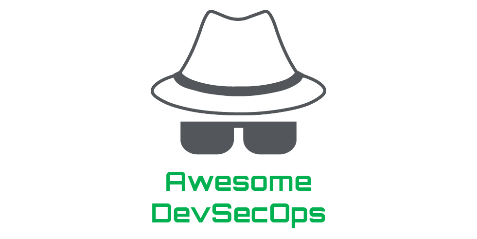

# Awesome DevSecOps  <!-- omit in toc -->

> Curating the best DevSecOps resources and tooling.

DevSecOps is an extension of the DevOps movement that aims to bring security practices into the development lifecycle through developer-centric security tooling and processes.

Contributions welcome. Add links through pull requests or create an issue to start a discussion.

<!-- omit in toc -->
## Contents
- [Resources](#resources)
  - [Articles](#articles)
  - [Communities](#communities)
  - [Conferences](#conferences)
  - [Podcasts](#podcasts)
  - [Secure Development Guidelines](#secure-development-guidelines)
  - [Secure Development Lifecycle Framework](#secure-development-lifecycle-framework)
  - [Toolchains](#toolchains)
  - [Training](#training)
- [Tools](#tools)
  - [Dependency Management](#dependency-management)
  - [Dynamic Analysis](#dynamic-analysis)
  - [Infrastructure as Code Analysis](#infrastructure-as-code-analysis)
  - [Intentionally Vulnerable Applications](#intentionally-vulnerable-applications)
  - [Secrets Management](#secrets-management)
  - [Static Analysis](#static-analysis)
  - [Threat Modelling](#threat-modelling)
- [Related Lists](#related-lists)

## Resources

### Articles

- [Our Approach to Employee Security Training](https://www.pagerduty.com/blog/security-training-at-pagerduty/) - _Pager Duty_

### Communities

- [MyDevSecOps](https://www.mydevsecops.io/) - _Snyk_

### Conferences

- [AppSec Day](https://appsecday.io/) - _OWASP_
- [DevSecCon](https://www.devseccon.com/) - _Snyk_

### Podcasts

- [Absolute AppSec](https://absoluteappsec.com/) - _Seth Law & Ken Johnson_
- [Application Security Podcast](https://podcast.securityjourney.com/) - _Security Journey_
- [BeerSecOps](https://blog.aquasec.com/devsecops-podcasts) - _Aqua Security_
- [DevSecOps Podcast Series](https://soundcloud.com/owasp-podcast) - _OWASP_
- [The Secure Developer](https://www.mydevsecops.io/the-secure-developer-podcast) - _Snyk_

### Secure Development Guidelines

- [Application Security Verification Standard](https://owasp.org/www-project-application-security-verification-standard/) - _OWASP_
- [Coding Standards](https://wiki.sei.cmu.edu/confluence/display/seccode/SEI+CERT+Coding+Standards) - _CERT_
- [Proactive Controls](https://owasp.org/www-project-proactive-controls/) - _OWASP_
- [Secure Coding Guidelines](https://wiki.mozilla.org/WebAppSec/Secure_Coding_Guidelines) - _Mozilla_
- [Secure Coding Practices Quick Reference Guide](https://www.owasp.org/images/0/08/OWASP_SCP_Quick_Reference_Guide_v2.pdf) - _OWASP_

### Secure Development Lifecycle Framework

- [Secure Development Lifecycle](https://www.microsoft.com/en-us/securityengineering/sdl/practices) - _Microsoft_
- [Secure Software Development Framework](https://csrc.nist.gov/CSRC/media/Publications/white-paper/2019/06/07/mitigating-risk-of-software-vulnerabilities-with-ssdf/draft/documents/ssdf-for-mitigating-risk-of-software-vulns-draft.pdf) - _NIST_
- [Software Assurance Maturity Model](https://github.com/OWASP/samm) - _OWASP_

### Toolchains

- [Periodic Table of DevOps Tools](https://xebialabs.com/periodic-table-of-devops-tools/) - _XebiaLabs_
- [Secure DevOps Toolchain](https://www.sans.org/security-resources/posters/secure-devops-toolchain-swat-checklist/60/download) - _SANS_

### Training

- [Security Training for Engineers](https://sudo.pagerduty.com/for_engineers/) - _Pager Duty_
- [Security Training for Everyone](https://sudo.pagerduty.com/for_everyone/) - _Pager Duty_

## Tools

### Dependency Management

Open source software packages can speed up the development process by allowing developers to implement functionality without having to write all of the code. However, with the open source code comes open source vulnerabilities. Dependency management tools help manage vulnerabilities in open source packages by identifying and updating packages with known vulnerabilities.

- [Dependabot](https://dependabot.com/) - _GitHub_
- [Dependency-Check](https://owasp.org/www-project-dependency-check/) - _OWASP_
- [Dependency-Track](https://dependencytrack.org/) - _OWASP_
- [JFrog XRay](https://jfrog.com/xray/) - _JFrog_
- [NPM Audit](https://docs.npmjs.com/cli/audit) - _NPM_
- [Renovate](https://renovate.whitesourcesoftware.com/) - _WhiteSource_
- [Requires.io](https://requires.io/) - _Olivier Mansion & Alexis Tabary_
- [Snyk Open Source](https://snyk.io/) - _Snyk_

### Dynamic Analysis

Dynamic Analysis Security Testing (DAST) is a form of black-box security testing where a security scanner interacts with a running instance of an application, emulating malicious activity to find common vulnerabilities. DAST tools are commonly used in the initial phases of a penetration test, and can find vulnerabilities such as cross-site scripting, SQL injection, cross-site request forgery and information disclosure.

- [BurpSuite Enterprise Edition](https://portswigger.net/burp/enterprise) - _PortSwigger (Paid)_
- [Gauntlt](https://github.com/gauntlt/gauntlt) - _Gauntlt_
- [SSL Labs Scan](https://github.com/ssllabs/ssllabs-scan) - _SSL Labs_
- [Zed Attack Proxy (ZAP)](https://github.com/zaproxy/zaproxy) - _OWASP_

### Infrastructure as Code Analysis

Infrastructure as Code allows applications to be deployed reliably to a consistent environment. This not only ensures that infrastructure is consistently hardened, but also provides an opportunity to statically and dynamically analyse infrastructure definitions for vulnerable dependencies, hard-coded secrets, insecure configurations and unintentional changes in security configuration. The following tools facilitate this analysis.

<!-- omit in toc -->
#### Containers
- [Clair](https://github.com/quay/clair) - _Quay_
- [Dagda](https://github.com/eliasgranderubio/dagda/) - _Elías Grande_
- [Snyk Container](https://snyk.io/product/container-vulnerability-management/) - _Snyk (Paid Options)_

<!-- omit in toc -->
#### Terraform
- [Conftest](https://github.com/instrumenta/conftest) - _Instrumenta_
- [Terrascan](https://github.com/cesar-rodriguez/terrascan) - _Cesar Rodriguez_
- [Tfsec](https://github.com/liamg/tfsec) - _Liam Galvin_
- [Checkov](https://github.com/bridgecrewio/checkov) - _Bridgecrew_

<!-- omit in toc -->
#### Kubernetes
- [Conftest](https://github.com/instrumenta/conftest) - _Instrumenta_
- [Kubectrl Kubesec](https://github.com/controlplaneio/kubectl-kubesec) - _ControlPlane_
- [Kube-Score](https://github.com/zegl/kube-score) - _Gustav Westling_

### Intentionally Vulnerable Applications

Intentionally vulnerable applications are often useful when developing security tests and tooling to provide a place you can run tests and make sure they fail correctly. These applications can also be useful for understanding how common vulnerabilities are introduced into applications and let you practice your skills at exploiting them.

- [Bad SSL](https://github.com/chromium/badssl.com) - _The Chromium Project_
- [Damn Vulnerable Web App](http://www.dvwa.co.uk/) - _Ryan Dewhurst_
- [Juice Shop](https://github.com/bkimminich/juice-shop) - _OWASP_
- [NodeGoat](https://github.com/OWASP/NodeGoat) - _OWASP_
- [Vulnerable Web Apps Directory](https://owasp.org/www-project-vulnerable-web-applications-directory) - _OWASP_

### Secrets Management

The software we write needs to use secrets (passwords, API keys, certificates, database connection strings) to access resources, yet we cannot store secrets within the codebase as this leaves them vulnerable to compromise. Secret management tools provide a means to securely store, access and manage secrets.

- [Ansible Vault](https://docs.ansible.com/ansible/latest/user_guide/vault.html) - _Ansible_
- [AWS Key Management Service (KMS)](https://aws.amazon.com/kms/) - _Amazon AWS_
- [Azure Key Vault](https://azure.microsoft.com/en-au/services/key-vault/) - _Microsoft Azure_
- [BlackBox](https://github.com/StackExchange/blackbox) - _StackExchange_
- [Chef Vault](https://github.com/chef/chef-vault) - _Chef_
- [CredStash](https://github.com/fugue/credstash) - _Fugue_
- [CyberArk Application Access Manager](https://azure.microsoft.com/en-au/services/key-vault/) - _CyberArk_
- [Docker Secrets](https://docs.docker.com/engine/swarm/secrets/) - _Docker_
- [Git Secrets](https://github.com/awslabs/git-secrets) - _Amazon AWS_
- [Google Cloud Key Management Service (KMS)](https://cloud.google.com/kms) - _Google Cloud Platform_
- [HashiCorp Vault](https://www.vaultproject.io/) - _HashiCorp_
- [Pinterest Knox](https://github.com/pinterest/knox) - _Pinterest_
- [Secrets Operations (SOPS)](https://github.com/mozilla/sops) - _Mozilla_

### Static Analysis

Static Analysis Security Testing (SAST) tools scan software for vulnerabilities without executing the target software. Typically, static analysis will scan the source code for security flaws such as the use of unsafe functions, hard-coded secrets and configuration issues. SAST tools often come in the form of IDE plugins and CLIs that can be integrated into CI/CD pipelines.

<!-- omit in toc -->
#### Multi-Language Support

- [DevSkim](https://github.com/microsoft/DevSkim) - _Microsoft_
- [Graudit](https://github.com/wireghoul/graudit/) - _Eldar Marcussen_
- [LGTM](https://lgtm.com/) - _Semmle_
- [RIPS](https://www.ripstech.com/) - _RIPS Technologies (Paid)_
- [SonarQube](https://www.sonarqube.org/) - _SonarSource (Paid Options)_

<!-- omit in toc -->
#### C / C++

- [FlawFinder](https://dwheeler.com/flawfinder/) - _David Wheeler_

<!-- omit in toc -->
#### C#

- [Puma Scan](https://pumascan.com/) - _Puma Security (Paid Options)_

<!-- omit in toc -->
#### Java

- [Deep Dive](https://discotek.ca/deepdive.xhtml) - _Discotek.ca_
- [Find Security Bugs](https://find-sec-bugs.github.io/) - _OWASP_
- [SpotBugs](https://github.com/spotbugs/spotbugs) - _SpotBugs_

<!-- omit in toc -->
#### JavaScript

- [ESLint](https://eslint.org/) - _JS Foundation_

<!-- omit in toc -->
#### Go

- [GolangCI-Lint](https://github.com/golangci/golangci-lint) - _GolangCI_

<!-- omit in toc -->
#### .NET

- [Security Code Scan](https://security-code-scan.github.io/) - _Security Code Scan_

<!-- omit in toc -->
#### PHP

- [DawnScanner](https://github.com/thesp0nge/dawnscanner) - _Paolo Perego_
- [Phan](https://github.com/phan/phan) - _Phan_
- [PHPCS Security Audit](https://github.com/FloeDesignTechnologies/phpcs-security-audit) - _Floe_
- [Progpilot](https://github.com/designsecurity/progpilot) - _Design Security_

<!-- omit in toc -->
#### Python

- [Bandit](https://github.com/PyCQA/bandit) - _Python Code Quality Authority_

<!-- omit in toc -->
#### Ruby

- [Brakeman](https://brakemanscanner.org/) - _Justin Collins_

### Threat Modelling

Threat modelling is an engineering exercise that aims to identify threats, vulnerabilities and attack vectors that represent a risk to something of value.  Based on this understanding of threats, we can design, implement and validate security controls to mitigate threats. The following list of tools assist the threat modelling process.

- [Awesome Threat Modelling](https://github.com/hysnsec/awesome-threat-modelling) - _Practical DevSecOps_
- [Forseeti](https://www.foreseeti.com/) - _Forseeti (Paid)_
- [IriusRisk](https://iriusrisk.com/) - _IriusRisk (Paid)_
- [Raindance Project](https://github.com/devsecops/raindance) - _DevSecOps_
- [SD Elements](https://www.securitycompass.com/sdelements/threat-modeling/) - _Security Compass (Paid)_
- [Threat Dragon](https://owasp.org/www-project-threat-dragon/) - _OWASP_
- [Threat Modelling Tool](https://www.microsoft.com/en-us/securityengineering/sdl/threatmodeling) - _Microsoft_
- [Threatspec](https://threatspec.org/) - _Threatspec_

## Related Lists

- [Awesome Dynamic Analysis](https://github.com/mre/awesome-dynamic-analysis/) - _Matthias Endler_
- [Awesome Static Analysis](https://github.com/mre/awesome-static-analysis/) - _Matthias Endler_
- [Awesome Threat Modelling](https://github.com/hysnsec/awesome-threat-modelling) - _Practical DevSecOps_
- [Vulnerable Web Apps Directory](https://owasp.org/www-project-vulnerable-web-applications-directory) - _OWASP_
